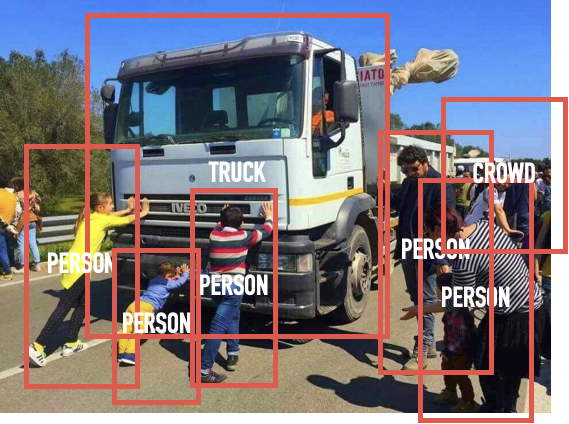

# Quantiative Visual Analysis Script Pack
As used in the paper...

> Di Ronco, A. & Allen-Robertson, J. (Under Review), Representations of
> environmental protest on the ground and in the cloud: The NoTap
> protests in activist practice and social visual media.
>
> Department of Sociology, University of Essex

## Description
This script pack contains the various tools built for the quantitiatve
analysis of a visual corpus. The method is designed to facilitate
thematic analysis of large scale image collections through image
deduplication, object detection and clustering. The system relies on
using [Google Vision](https://cloud.google.com/vision/) for the object detection phase. Google Vision's [API](https://cloud.google.com/vision/automl/object-detection/docs/quickstart-ui)
allows researchers to identify the contents of images at scale using
their trained object detection models. The process is relatively quick,
accurate and low cost.

## The Scripts
The scripts provided are taken straight from the associated project by
Di Ronco and Allen-Robertson. They are not meant to be used straight out
of the box for other projects, but can be drawn on to inform future
work, as well as provide transparency into the project's methodological
processes.

Broadly, the scripts are used in the following order....

1. `live_listener.py` Live retrieval of Tweets as an image
   source.
2. `retweet_extract.py ` Extract retweets from the original dataset to
   maximise sample size.
3. `convert_created_at.py` Transform the twitter time variables into a
   useable datetime format.
4. `main_download_images.py` - downloads Tweet images to local storage
   and creates a tweet-to-image lookup and a image-to-file lookup in
   MongoDB.
5. `image_hasher.py` - Uses hashing to produce a unique hash string for
   each image file. Used as part of the de-duplication
   process.
6. `hash_dedupe.py` Identifies potential duplicates based on hashing and
   records likely duplicates in the database.
7. `vision_tagger.py` Feeds image files to the Google Vision API for
   object detection, and records responses into the database.
8. `duplicate file scoring.ipynb` An exploratative notebook used to test
   various de-duplication strategies. These including measuring for
   duplicates using both hash similarity, and rank-order similarity of
   the tags assigned by Google Vision, using the Hungarian algorithm.
   For this project it was ultimately determined that hash similarity
   was a sufficient measure.
9. `duplicate file agglomeration.ipynb` A second notebook used to
   manually check the simialrity measures against human assessment.
   Decisions were recorded and used to assess the borderline similarity
   score at which two images should be considered similar enough to be
   duplicates.
10. `scored tag_categorisation.ipynb` Clustering of the images using the
    tag confidence scores as features. Requires dimensionality reduction
    and uses simple k-means clustering. The notebooks includes the steps
    for quantitative validation of the k-means model and the scripts to
    provide readable outputs for qualitative assessment of the clusters.

#### Note

The scripts require a [MongoDB](https://www.mongodb.com/) backend to manage the project data. Other
database options are available, though some stages of the data
restructuring relied on the MongoDB aggregation framework, particularly
the de-duplication stages.
